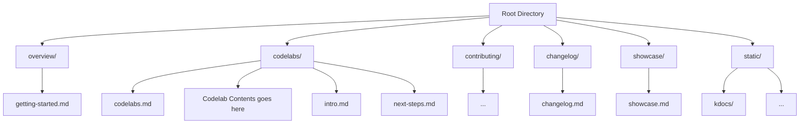

# Website

This website is built using [Docusaurus](https://docusaurus.io/), a modern static website generator.

## Installation

```bash
npm i
```

## Local Development

```bash
npm start
```

This command starts a local development server and opens up a browser window. Most changes are reflected live without having to restart the server.

## Build

```bash
npm run build
```

This command generates static content into the `build` directory and can be served using any static contents hosting service.

## Architecture




## Ask AI Widget

The site includes an AI chat widget ("Ask AI") that lets developers ask questions about Multipaz and get answers grounded in the official documentation.

### Architecture

```
┌──────────────────────────────────┐
│  Docusaurus Site (Frontend)      │
│                                  │
│  src/components/AskAIWidget.js   │
│  └─ Chat UI, streams responses   │
│     via Server-Sent Events       │
│                                  │
│  src/theme/Root.js               │
│  └─ Mounts widget on every page  │
└──────────────┬───────────────────┘
               │ POST /api/chat
               ▼
┌──────────────────────────────────┐
│  Vercel Serverless (api/)        │
│                                  │
│  api/chat.js                     │
│  └─ Gemini 2.5 Flash            │
│     + full docs as system prompt │
│                                  │
│  docs-context.txt (bundled)      │
│  └─ Built by build-docs-context  │
└──────────────────────────────────┘
```

See [api/README.md](api/README.md) for API setup, environment variables, and endpoint documentation.

### How the docs context is built

`api/build-docs-context.js` produces `api/docs-context.txt`, which is the knowledge base sent to Gemini as a system prompt. It aggregates content from two sources:

**Local directories** (from this repo):
| Directory | Content |
|---|---|
| `docs/` | SDK guides (getting started, issuer, verifier, etc.) |
| `codelabs/` | Step-by-step codelab tutorials |
| `contributing/` | Contribution guidelines |
| `blog/` | Blog posts |

**Remote files** (fetched from [openwallet-foundation/multipaz](https://github.com/openwallet-foundation/multipaz) at build time):
| File | Content |
|---|---|
| `README.md` | Library overview and module descriptions |
| `CHANGELOG.md` | Release notes and API changes |
| `DEVELOPER-ENVIRONMENT.md` | Dev setup instructions |
| `TESTING.md` | Test commands and procedures |
| `CODING-STYLE.md` | Kotlin coding conventions |
| `CONTRIBUTING.md` | PR and code review guidelines |
| `multipaz-cbor-rpc/RPC.md` | RPC system architecture |
| `multipaz-cbor-rpc/README.md` | CBOR serialization details |
| `multipaz-server-deployment/README.md` | Docker/Podman deployment guide |

### Rebuilding the docs context

After adding or modifying documentation in any of the sources above, rebuild the context file:

```bash
cd api
npm run build-context
```

This fetches the latest remote files and re-aggregates everything into `docs-context.txt`. The file is bundled into the Vercel serverless function at deploy time via `vercel.json`.

### Adding new documentation sources

To include a new **local directory**, add it to the `DOCS_DIRS` array in `api/build-docs-context.js`.

To include a new **file from the multipaz repo**, add its path to the `MULTIPAZ_REPO_FILES` array in the same file.

### Environment variables

**API server** (set in Vercel):
| Variable | Description |
|---|---|
| `GEMINI_API_KEY` | Google Gemini API key |
| `ALLOWED_ORIGINS` | Comma-separated list of allowed CORS origins |
| `RATE_LIMIT_PER_MIN` | Max requests per IP per minute (default: 10) |
| `DAILY_REQUEST_LIMIT` | Max total requests per day across all users (default: 300) |

**Docusaurus build** (set as [GitHub repo variables](https://docs.github.com/en/actions/writing-workflows/choosing-what-your-workflow-does/store-information-in-variables#creating-configuration-variables-for-a-repository) under Settings → Secrets and variables → Actions → Variables):
| Variable | Description |
|---|---|
| `ASK_AI_API_URL` | URL of the deployed Ask AI API (e.g., your Vercel deployment URL) |
| `WEBSITE_ENVIRONMENT` | `PRODUCTION` to serve at `/` (custom domain), `DEVELOPMENT` to serve at `/{repo-name}/` |
| `BUILD_KDOCS` | Set to `false` to skip API reference KDoc generation for faster builds (see [Skipping KDoc Generation](#skipping-kdoc-generation-faster-builds)). Optional; defaults to building KDocs |

### Deploying the API server to Vercel

```bash
cd api
npm install
npm run build-context   # rebuild docs-context.txt
vercel --prod           # deploy to production
```

On first deploy, Vercel will prompt you to link the project. After that, subsequent deploys with `vercel --prod` will update the production deployment.

## CI Config

### Overview
This project uses two repositories with automated documentation integration:

Kotlin Repo: Source code with KDocs
Docusaurus Repo: Documentation site that displays the generated API docs

```

┌─────────────────────┐     ┌──────────────────────┐
│  Kotlin Repository  │     │ Docusaurus Repository│
│                     │     │                      │
│  ┌───────────────┐  │     │  ┌───────────────┐   │
│  │  Source Code  │  │     │  │  Markdown     │   │
│  └───────┬───────┘  │     │  │  Documentation│   │
│          │          │     │  └───────────────┘   │
│  ┌───────▼───────┐  │     │                      │
│  │  Dokka Tool   │  │     │  ┌───────────────┐   │
│  └───────┬───────┘  │     │  │  Static Dir   │   │
│          │          │     │  │  ┌─────────┐  │   │
│  ┌───────▼───────┐  │     │  │  │ /api/   │◄─┼───┘
│  │ Generated     │  │     │  │  └─────────┘  │   │
│  │ API Docs      │──┼─────┼─►│               │   │
│  └───────────────┘  │     │  └───────────────┘   │
└─────────────────────┘     └──────────────────────┘

```

### Automation Workflow
[Code Changes] → [Trigger Action] → [Build KDocs] → [Copy to Docusaurus] → [Deploy Site]

GitHub Actions Setup

1. In Multipaz Repository => [.github/workflows/trigger-docusaurus-update.yml](https://github.com/openwallet-foundation/multipaz/blob/main/.github/workflows/trigger-docusaurus-update.yml)
2. In Multipaz Developer Website Repository => [.github/workflows/docs.yml](https://github.com/openwallet-foundation/multipaz-developer-website/blob/main/.github/workflows/docs.yml)

### Skipping KDoc Generation (faster builds)

Generating the API reference KDocs (`./gradlew dokkaGenerate` for both the
`multipaz` and `multipaz-extras` repos) is by far the slowest part of the build.
The `BUILD_KDOCS` flag lets you skip it — useful for forks and quick test
deployments that don't need the API reference. When skipped, the site still
builds and deploys; only the `/kdocs` and `/kdocs-extras` API reference pages are
omitted (links into them will 404 on that deployment).

There are two ways to control it:

| How | Scope | Effect |
|---|---|---|
| **`build_kdocs` checkbox** on the manual *Run workflow* dialog (Actions → Build and Deploy Docusaurus with KDocs → Run workflow) | A single manual run | Tick to build, untick to skip. **Overrides the repository variable.** |
| **`BUILD_KDOCS` repository variable** (Settings → Secrets and variables → Actions → **Variables** → New repository variable) | All automatic runs (push / `repository_dispatch`) | Set to `false` to permanently skip KDoc generation. Any other value (or unset) builds them. |

`BUILD_KDOCS` is a repository **variable**, not a secret — no secret needs to be
configured for this. The checkbox is authoritative on manual runs; the variable
only governs automatic runs.

### Required Repository Settings

To enable automatic documentation updates between repositories, you need to set up a Personal Access Token (PAT).

#### Step 1: Generate Personal Access Token

1. **Go to GitHub Settings**: Navigate to [https://github.com/settings/personal-access-tokens/new](https://github.com/settings/personal-access-tokens/new)
2. **Select Token Type**: Choose "Fine-grained personal access tokens"
3. **Configure Token Settings**:
   - **Token name**: `DOCS_REPO_ACCESS_TOKEN`
   - **Description**: `Token for automated documentation updates between multipaz and developer website repo`
   - **Expiration**: `366 days` (or your preferred duration)
4. **Set Repository Access**:
   - **Resource Owner**: `openwallet-foundation`
   - **Repository access**: `Selected repositories`
   - **Select repository**: `openwallet-foundation/multipaz-developer-website`
5. **Set Permissions**:
   - **Content**: `Read and write`
   - **Metadata**: `Read`
6. **Generate Token**: Click "Generate token" and **copy the token immediately** (it won't be shown again)

#### Step 2: Add Token as Repository Secret

1. **Go to Multipaz Repository**: Navigate to [https://github.com/openwallet-foundation/multipaz/settings/secrets/actions](https://github.com/openwallet-foundation/multipaz/settings/secrets/actions)
2. **Add New Secret**:
   - Click "New repository secret"
   - **Name**: `DOCS_REPO_ACCESS_TOKEN`
   - **Secret**: Paste the token you generated in Step 1
   - Click "Add secret"

#### What This Enables

This setup allows the [Trigger Docs Update workflow](https://github.com/openwallet-foundation/multipaz/blob/main/.github/workflows/trigger-docusaurus-update.yml) to automatically update the developer website whenever changes are made to the multipaz repository.

## GitHub Pages Setup

Docusaurus can run in two modes depending on your deployment setup:

### Option 1: Custom Domain (PRODUCTION mode)
For custom domains like `developer.multipaz.org`:

1. **Enable GitHub Pages**: In Docusaurus repo, go to **Settings → Pages** and enable GitHub Pages with GitHub Actions as source
2. **Set Custom Domain**: Under **Custom domain**, enter:  
   ```
   developer.multipaz.org
   ```  
3. **Save Changes**: Click save to apply the custom domain
4. **Verify DNS**: Optionally, verify that DNS settings (CNAME or A records) are set properly for `developer.multipaz.org` pointing to GitHub Pages
5. **Set Environment Variable**: Configure `WEBSITE_ENVIRONMENT` GitHub repository variable as `PRODUCTION`

### Option 2: GitHub Pages Subdomain (DEVELOPMENT mode)
For github.io pages like `openwallet-foundation.github.io/multipaz-developer-website`:

1. **Enable GitHub Pages**: In Docusaurus repo, go to **Settings → Pages** and enable GitHub Pages with GitHub Actions as source
2. **Set Environment Variable**: Configure `WEBSITE_ENVIRONMENT` GitHub repository variable as `DEVELOPMENT`
3. **No Custom Domain**: Leave the custom domain field empty

### Deployment
After configuration:
- Trigger the [`Build and Deploy Docusaurus with KDocs`](https://github.com/openmobilehub/developer-multipaz-website/actions/workflows/docs.yml) workflow
- The `baseUrl` will automatically be set to:
  - `/` for custom domains (PRODUCTION mode)
  - `/{repository_name}` for github.io pages (DEVELOPMENT mode)

### Reference
See GitHub's guide for more details: [Configuring a custom domain for your GitHub Pages site](https://docs.github.com/en/pages/configuring-a-custom-domain-for-your-github-pages-site)
