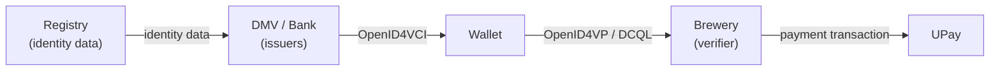

# Before You Begin

Every credential needs an **issuer** that mints it and a **verifier** that checks it. This codelab is about that other half of the ecosystem: the servers.

The **Utopia Universe** is a self-contained sandbox of five fictional organizations, packaged as a
single container image. Running it gives you a complete, local digital-identity economy that a real
Multipaz wallet can interact with.

## The cast

| Organization       | Role                              | What it demonstrates                                                                 |
| ------------------ | --------------------------------- | ------------------------------------------------------------------------------------ |
| **Utopia DMV**     | Credential **issuer**             | OpenID4VCI issuance of an ISO mDL (`org.iso.18013.5.1.mDL`)                           |
| **Bank of Utopia** | Credential **issuer**             | Issuance of a digital payment credential (`org.multipaz.payment.sca.1`)              |
| **Registry**       | System of records + web frontend  | The identity data store that issuers draw from                                       |
| **UPay**           | Payment **processor / verifier**  | Account-to-account transactions behind a payment credential                          |
| **Brewery**        | **Verifier** (storefront)         | OpenID4VP with DCQL — age verification **and** payment in one presentation           |

The flow they implement together looks like this:

## What you'll learn

- How to build and run the Utopia Universe server bundle with Podman or Docker.
- How an OpenID4VCI **issuer** server is wired up (DMV and Bank).
- How an OpenID4VP **verifier** uses a **DCQL** query with `claim_sets` to verify age across several
  credential types — and how a **digital payment credential (DPC)** rides along in the same request.
- Where the extension points are (`IssuerAssistant`, `VerifierAssistant`) so you can graft your own
  business logic onto issuance and verification.

## What you'll need

- **Java 17+** (to build the bundle).
- **Podman** (recommended) or **Docker** (to run it). Installation is covered in the next step.
- A **Multipaz wallet** on a phone or emulator to obtain and present credentials. If you don't have
  one, the [Utopia Wholesale codelab](../Utopia%20Wholesale%20Codelab/index.md) walks you through
  building one, or you can use the [Multipaz sample apps](https://apps.multipaz.org/).
- Basic familiarity with **OpenID4VCI** (issuance) and **OpenID4VP** (presentation). A quick read of
  the [Getting Started](../../docs/) docs is enough.

:::note
The Utopia Universe is a **demo sandbox**, not a production deployment. The organizations are
fictional, credentials are minted from seed data, and several services run with an ephemeral
in-memory store. It exists so you can see issuer and verifier servers working together on your own
machine.
:::

:::tip Prefer to skip the build?
The whole thing is already live at **[utopia.multipaz.org](https://utopia.multipaz.org)**. You can
explore it right now, or follow along locally.
:::

When you're ready, head to **Get Set Up**.
